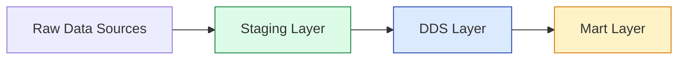
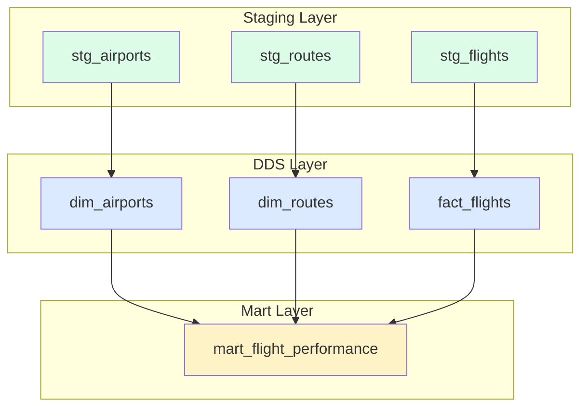
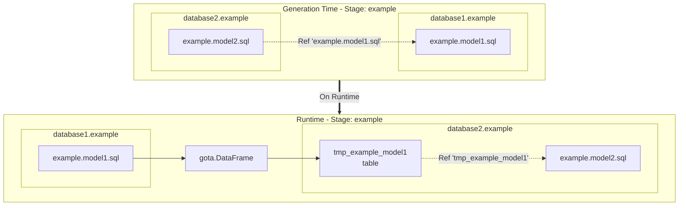
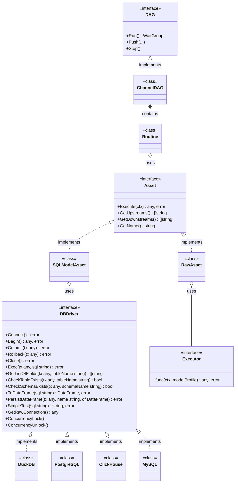

## Overview

Teal is a high-performance, scalable open-source ETL tool built on Go, designed to streamline data transformation and orchestration. It combines the best features of tools like [dbt](https://www.getdbt.com/), [Dagster](https://dagster.io/), and [Airflow](https://airflow.apache.org/), while solving common problems found in traditional Python-based solutions.

### Understanding DAGs in Teal

At the core of Teal's execution model is the **Directed Acyclic Graph (DAG)**, a fundamental concept in data pipeline orchestration. A DAG represents your data transformation workflow where:

- **Nodes** are your SQL models (assets) - each representing a data transformation
- **Edges** are dependencies between models - automatically created when one model references another using the `{{ Ref("stage.model_name") }}` function
- **Directed** means dependencies flow in one direction (from source data → staging → transformations → analytics)
- **Acyclic** means no circular dependencies - preventing infinite loops in your pipeline

When you run Teal, it analyzes all your SQL models, builds the dependency graph, and executes them in the correct topological order, ensuring that upstream models complete before downstream models that depend on them.

**Go Concurrency & Performance:**

Teal leverages **Go's concurrency primitives** (goroutines and channels) to maximize parallel execution:
- Each independent asset executes in its own **goroutine** for true parallelism
- **Channels** coordinate dependencies and synchronize execution flow
- Assets at the same DAG level run **concurrently** when dependencies allow
- Optimized for multi-core CPUs to minimize total pipeline execution time

### Assets: The Building Blocks

In Teal, an **asset** is a unit of data transformation or computation. There are two types:

**1. SQL Model Assets**

SQL files that transform data using SELECT statements. Each SQL model automatically becomes a node in the DAG. For example:

```sql
-- This model depends on staging.stg_airports
select
    sha256(airport_code::varchar) as airport_key,
    airport_code,
    airport_name,
    city
from {{ Ref("staging.stg_airports") }}
```

The `{{ Ref() }}` function serves two purposes:
- Declares a dependency (creates an edge in the DAG)
- Gets replaced with the actual table/view name during code generation

**2. Raw Assets**

Custom Go functions for complex operations beyond SQL capabilities (API calls, file processing, custom algorithms). These integrate seamlessly into the DAG alongside SQL models.

### Stage Architecture: Organizing Your Pipeline

Teal allows you to organize your data pipeline into **stages** - logical groupings of models that represent phases in your data transformation workflow. You can define **any number of stages** that fit your architecture in the `profile.yaml` file.

A common pattern is the **three-tier medallion architecture**, but you're free to use as many stages as needed (e.g., `raw`, `staging`, `intermediate`, `dds`, `mart`, `reporting`):



**Example: Three-Tier Pattern**

**Staging Layer** (`staging/`)
- **Purpose**: Raw data ingestion and initial cleaning
- **Operations**: Load CSV files, database tables via connections (e.g., DuckDB's `postgres_scan` or `attach` patterns), API responses, or mount tables to external databases
- **Characteristics**: Minimal transformations, 1:1 with source systems
- **Materialization**: Usually `table` (see [Materializations](#materializations))
- **Note**: Database engines like DuckDB support reading from external databases using `db_link` patterns (e.g., [postgres extension](https://duckdb.org/docs/stable/core_extensions/postgres)) or mounting tables. These patterns require installation of database extensions (see [DuckDB extensions](#duckdb) configuration). To mount a table to an external database, use a `custom` or `raw` SQL asset

**DDS Layer** (`dds/` - Data Distribution Service)
- **Purpose**: Dimensional modeling and business logic
- **Operations**: Create dimensions and facts, apply business rules, add surrogate keys
- **Characteristics**: Normalized structures, referential integrity, warehouse audit columns
- **Materialization**: Usually `table` with indexes and primary keys (see [Materializations](#materializations))

**Mart Layer** (`mart/`)
- **Purpose**: Aggregated analytics and reporting
- **Operations**: Multi-table joins, aggregations, KPI calculations
- **Characteristics**: Denormalized for query performance, business-friendly naming
- **Materialization**: Usually `view` for real-time data or `table` for performance (see [Materializations](#materializations))

Stages are purely organizational - they help you structure your codebase and visualize your pipeline, but Teal's DAG execution is determined solely by `{{ Ref() }}` dependencies, not stage names.

#### Folder Structure and Configuration

To create stages in your Teal project, follow this structure:

```txt
your-project/
├── profile.yaml          # Define your stages here
├── config.yaml           # Database connections
├── assets/
│   ├── models/           # SQL model assets
│   │   ├── staging/      # Stage folder (must match profile.yaml)
│   │   │   ├── stg_flights.sql
│   │   │   └── stg_airports.sql
│   │   ├── dds/          # Stage folder
│   │   │   ├── dim_airports.sql
│   │   │   └── fact_flights.sql
│   │   └── mart/         # Stage folder
│   │       └── mart_flight_performance.sql
│   └── tests/            # Test assets
│       ├── test_data_integrity.sql
│       └── dds/
│           └── test_dim_airports_unique.sql
└── store/                # Data files (CSV, DuckDB, etc.)
    ├── flights.csv
    └── test.duckdb
```

**How to configure stages:**

1. **Define stages in `profile.yaml`**:

```yaml
version: '1.0.0'
name: 'my-project'
connection: 'default'
models:
  stages:
    - name: staging
    - name: dds
    - name: mart
```

2. **Create corresponding folders** under `assets/models/`:
   - Each stage name in `profile.yaml` must have a matching folder
   - Folder names must exactly match the stage names
   - Place your `.sql` files inside these folders

3. **Create SQL model files**:
   - File name becomes the model name (without `.sql` extension)
   - Reference models using `{{ Ref("stage_name.model_name") }}`
   - Example: `{{ Ref("staging.stg_flights") }}` refers to `assets/models/staging/stg_flights.sql`

4. **Tests** (optional):
   - Place test files in `assets/tests/`
   - Can organize tests by stage in subfolders (e.g., `assets/tests/dds/`)
   - Reference in model profiles using `tests:` parameter

### Building a SQL DAG: Complete Example

Let's see how a complete three-tier pipeline works using a flight analytics example:

#### Stage 1: Staging - Data Ingestion

```sql
-- File: assets/models/staging/stg_flights.sql
{{ define "profile.yaml" }}
    materialization: 'table'
    description: 'Flight operations staging - raw CSV ingestion'
{{ end }}

select
    flight_id,
    flight_number,
    route_id,
    aircraft_type,
    scheduled_departure,
    scheduled_arrival,
    actual_departure,
    actual_arrival,
    status
from read_csv('store/flights.csv',
    delim = ',',
    header = true,
    columns = {
        'flight_id': 'INT',
        'flight_number': 'VARCHAR',
        'route_id': 'INT',
        'aircraft_type': 'VARCHAR',
        'scheduled_departure': 'TIMESTAMP',
        'scheduled_arrival': 'TIMESTAMP',
        'actual_departure': 'TIMESTAMP',
        'actual_arrival': 'TIMESTAMP',
        'status': 'VARCHAR'
    }
)
```

This staging model:
- Reads raw CSV data using DuckDB's `read_csv` function (see [Databases](#databases))
- Uses [`materialization: 'table'`](#materializations) to create a persistent table (see [Materializations](#materializations))
- No dependencies yet - it's a source node in the DAG
- Defines typed columns for data quality and schema enforcement

#### Stage 2: DDS - Dimensional Modeling with Incremental Loading

```sql
-- File: assets/models/dds/fact_flights.sql
{{ define "profile.yaml" }}
    materialization: 'incremental'
    is_data_framed: True
    description: 'Flight operations fact table with incremental loading'
    primary_key_fields: ['flight_key']
    indexes:
      - name: 'flight_id_idx'
        unique: true
        fields: ['flight_id']
      - name: 'flight_date_idx'
        fields: ['flight_date']
{{ end }}

with flight_staging as (
    select
        f.*,
        r.route_key,
        r.origin_airport_key,
        r.destination_airport_key,
        r.average_duration_minutes as route_avg_duration
    from {{ Ref("staging.stg_flights") }} f
    inner join {{ Ref("dds.dim_routes") }} r
        on f.route_id = r.route_id
    where f.status = 'COMPLETED'
)
select
    sha256(origin_airport_key || '-' || destination_airport_key || '-' || flight_number) as flight_key,
    flight_id,
    flight_number,
    route_key,
    origin_airport_key,
    destination_airport_key,
    scheduled_departure,
    actual_departure,
    actual_arrival,
    date(scheduled_departure) as flight_date,
    extract(year from scheduled_departure) as flight_year,
    -- Calculate delays in minutes
    extract(epoch from (actual_departure - scheduled_departure)) / 60 as departure_delay_minutes,
    extract(epoch from (actual_arrival - scheduled_arrival)) / 60 as arrival_delay_minutes,
    -- Performance indicators
    case
        when extract(epoch from (actual_arrival - scheduled_arrival)) / 60 <= 15 then true
        else false
    end as on_time_arrival,
    current_timestamp as dw_created_at
from flight_staging

where actual_arrival > (select coalesce(max(actual_arrival), '1900-01-01'::timestamp) from {{ this() }})

```

This fact table model demonstrates **incremental loading**:
- **Depends on** `staging.stg_flights` and `dds.dim_routes` via [`{{ Ref() }}`](/api/#template-functions) - creates edges in the DAG
- Uses [`materialization: 'incremental'`](#materializations) to append only new data instead of full refresh (see [Materializations](#materializations))
- **IsIncremental() pattern**: The [``](/api/#template-functions) block adds a filter on subsequent runs (see [Template Functions](/api/#template-functions)):
  - **First run**: No filter, loads all historical data
  - **Subsequent runs**: Only loads flights with `actual_arrival` newer than the max value already in the table
  - Uses [`{{ this() }}`](/api/#template-functions) to reference the current table for checking the max timestamp
- Adds **surrogate key** using SHA256 hashing for composite business keys
- Calculates **derived metrics** (delays, on-time performance) at load time
- Defines **indexes** on flight_id (unique) and flight_date for query performance
- Uses `is_data_framed: True` for cross-database operations (see [Cross-Database References](#cross-database-references))

**Why Incremental Loading?**
- **Performance**: Only processes new records, not entire dataset every time
- **Efficiency**: Reduces compute time and costs for large fact tables
- **Speed**: Faster DAG execution as data volume grows
- **Use Case**: Perfect for append-only fact tables with timestamp-based filtering

**Testing Fact Tables:**

Data quality is critical for fact tables. Here's an example test for `fact_flights` that validates business rules:

```sql
-- File: assets/tests/test_flight_delays.sql
{{ define "profile.yaml" }}
    connection: 'default'
    description: 'Flight delay anomaly detection - validates realistic operational data'
{{ end }}

-- Test passes if no flights have unrealistic delays
-- Returns rows only when data quality issues are found
select
    flight_id,
    flight_number,
    departure_delay_minutes,
    arrival_delay_minutes,
    case
        when departure_delay_minutes > 1440 then 'Excessive departure delay (>24h)'
        when arrival_delay_minutes > 1440 then 'Excessive arrival delay (>24h)'
        when departure_delay_minutes < -120 then 'Departed too early (>2h)'
        when arrival_delay_minutes < -120 then 'Arrived too early (>2h)'
    end as issue_type
from {{ Ref("dds.fact_flights") }}
where
    departure_delay_minutes > 1440
    or arrival_delay_minutes > 1440
    or departure_delay_minutes < -120
    or arrival_delay_minutes < -120
```

This test:
- **Validates business rules**: Checks that delays fall within realistic operational ranges
- **Uses `{{ Ref() }}`**: Creates a dependency on `fact_flights` in the DAG (test runs after the fact table is built)
- **Returns anomalies**: Query returns rows only when issues are detected (empty result = test passes)
- **Catches data quality issues**: Identifies timezone errors, date rollover problems, or system integration failures
- **Prevents bad analytics**: Stops unrealistic data from skewing KPIs and forecasts

See [Data Testing](#data-testing) for more details on writing and organizing tests.

#### Stage 3: Mart - Analytics & Reporting

```sql
-- File: assets/models/mart/mart_flight_performance.sql
{{ define "profile.yaml" }}
    materialization: 'view'
    is_data_framed: True
    description: 'Route-level operational performance analytics'
{{ end }}

select
    -- Route information
    r.origin_airport,
    origin.airport_name as origin_airport_name,
    r.destination_airport,
    dest.airport_name as destination_airport_name,

    -- Flight metrics
    count(distinct f.flight_id) as total_flights,

    -- Delay metrics
    avg(f.departure_delay_minutes) as avg_departure_delay_minutes,
    avg(f.arrival_delay_minutes) as avg_arrival_delay_minutes,

    -- On-time performance (within 15 minutes)
    sum(case when f.arrival_delay_minutes <= 15 then 1 else 0 end)::float
        / count(*) * 100 as on_time_arrival_pct,

    f.flight_year,
    f.flight_month

from {{ Ref("dds.fact_flights") }} f
join {{ Ref("dds.dim_routes") }} r on f.route_key = r.route_key
join {{ Ref("dds.dim_airports") }} origin on f.origin_airport_key = origin.airport_key
join {{ Ref("dds.dim_airports") }} dest on f.destination_airport_key = dest.airport_key
group by
    r.origin_airport,
    origin.airport_name,
    r.destination_airport,
    dest.airport_name,
    f.flight_year,
    f.flight_month
```

This mart model:
- **Depends on** three DDS models via [`{{ Ref() }}`](/api/#template-functions) - creates multiple edges in the DAG (see [Template Functions](/api/#template-functions))
- Performs **multi-table joins** across dimensions and facts
- Calculates **aggregated KPIs** (on-time percentage, average delays)
- Uses [`materialization: 'view'`](#materializations) for real-time analytics (see [Materializations](#materializations))
- Won't execute until all upstream dependencies complete

### DAG Execution Flow

When you run `teal`, here's what happens:



1. **Staging models** execute first (no dependencies) - can run in parallel
2. **DDS models** execute after their staging dependencies complete - some parallelization possible
3. **Mart models** execute last after all DDS dependencies complete

Teal's DAG engine automatically determines the optimal execution order and maximizes parallelization where possible using Go's concurrency primitives.

## Configuration

### config.yaml

The `config.yaml` file defines your project module and database connections:

```yaml
version: '1.0.0'
module: github.com/my_user/my_test_project
connections:
  - name: default
    type: duckdb
    config:
      path: ./store/test.duckdb
      extensions:
        - postgres
        - httpfs
```

**Parameters:**

| Param | Type | Description |
|-------|------|-------------|
| version | String constant | `1.0.0` |
| module | String | Generated Go module name |
| connections | Array of objects | Array of database connections |
| connections.name | String | Name of the connection used in the model profile |
| connections.type | String | Driver name: `duckdb`, `postgres` |

Teal supports multiple connections. See [Databases](#databases) section for specific configuration parameters.

### profile.yaml

The `profile.yaml` file defines your project structure and model stages:

```yaml
version: '1.0.0'
name: 'my-test-project'
connection: 'default'
models:
  stages:
    - name: staging
      models:
        - name: model1
          tests:
            - name: "root.test_model1_unique"
    - name: dds
    - name: mart
      models:
        - name: custom_asset
          materialization: 'raw'
          connection: 'default'
          raw_upstreams:
            - "dds.model1"
            - "dds.model2"
```

**Parameters:**

| Param | Type | Description |
|-------|------|-------------|
| version | String constant | `1.0.0` |
| name | String | Base name for generated binaries (creates both production and UI versions) |
| connection | String | Default connection from `config.yaml` |
| models.stages | Array | List of stages; folder `assets/models/<stage name>` must exist |

#### Model Profile

Asset profiles can be specified via `profile.yaml` or via a Go template in your SQL model file:

```sql
{{ define "profile.yaml" }}
    connection: 'default'
    description: 'Staging addresses from CSV file'
    materialization: 'table'
    is_data_framed: true
    primary_key_fields:
      - "id"
    indexes:
      - name: "wallet"
        unique: false
        fields:
          - "wallet_id"
{{ end }}

select
    id,
    wallet_id,
    wallet_address,
    currency
from read_csv('store/addresses.csv',
    delim = ',',
    header = true,
    columns = {
        'id': 'INT',
        'wallet_id': 'VARCHAR',
        'wallet_address': 'VARCHAR',
        'currency': 'VARCHAR'}
)
```

**Model Profile Parameters:**

| Param | Type | Default | Description |
|-------|------|---------|-------------|
| name | String | filename | Must match file name (without .sql extension) |
| description | String | | Optional description of the model's purpose |
| connection | String | profile.connection | Connection name from `config.yaml` |
| materialization | String | table | See [Materializations](#materializations) |
| is_data_framed | boolean | false | See [Cross-database references](#cross-database-references) |
| persist_inputs | boolean | false | See [Cross-database references](#cross-database-references) |
| primary_key_fields | Array of string | | List of fields for primary unique index |
| indexes | Array | | List of indexes (table and incremental only) |

## Materializations

Teal supports several materialization types for your SQL models:

| Materialization | Description |
|----------------|-------------|
| **table** | Result stored in table matching model name. If table exists, it's truncated. If not, it's created. |
| **incremental** | Result appended to existing table. If table doesn't exist, it's created. |
| **view** | SQL query saved as a view. |
| **custom** | Custom SQL query executed; no tables or views created. |
| **raw** | Custom Go function executed. |

## Databases

### DuckDB

**Configuration Parameters:**

| Param | Type | Description |
|-------|------|-------------|
| connections.type | String | `duckdb` |
| extensions | Array of strings | List of [DuckDB extensions](https://duckdb.org/docs/extensions/overview.html) |
| path | String | Path to the DuckDB database file |
| path_env | String | Environment variable containing the path (overrides `path`) |
| extraParams | Object | Name-value pairs for [DuckDB configuration](https://duckdb.org/docs/configuration/overview.html) |

### PostgreSQL

**Configuration Parameters:**

| Param | Type | Description |
|-------|------|-------------|
| connections.type | String | `postgres` |
| host | String | Hostname or IP address of PostgreSQL server |
| host_env | String | Environment variable name for host |
| port | String | Port number (default: 5432) |
| port_env | String | Environment variable name for port |
| database | String | Database name |
| database_env | String | Environment variable name for database |
| user | String | Username for authentication |
| user_env | String | Environment variable name for user |
| password | String | Password for authentication |
| password_env | String | Environment variable name for password |
| db_root_cert | String | Path to root certificate file for SSL |
| db_root_cert_env | String | Environment variable name for root cert path |
| db_cert | String | Path to client certificate file for SSL |
| db_cert_env | String | Environment variable name for client cert path |
| db_key | String | Path to client key file for SSL |
| db_key_env | String | Environment variable name for client key path |
| db_sslnmode | String | SSL mode: `disable`, `require`, `verify-ca`, `verify-full` |
| db_sslnmode_env | String | Environment variable name for SSL mode |
| pool_max_conns | Int | Max open connections in the pgxpool. `0` (or unset) keeps pgxpool's default of `4`. Raise this if the DAG has many independent assets that can execute in parallel; cap it well below your PostgreSQL `max_connections` budget. |

The PostgreSQL driver is backed by `pgxpool.Pool`, so concurrent asset execution checks out separate connections from the pool. With the default of 4, a DAG with more concurrently-runnable assets will queue on `Begin()`; bump `pool_max_conns` to widen the concurrency.

## Build Tags

Teal uses Go build tags to keep production binaries small. The **production binary** (`cmd/<project>/`) compiles with no extra tags and pulls only what the DAG runtime needs (pgx + zerolog + pongo2 + a small graph of utilities). The **debug UI binary** (`cmd/<project>-ui/`) depends on `pkg/ui`, which in turn brings in **gin** + `gin-contrib/cors` + a heavy transitive tree (sonic, bytedance JIT, validator, mimetype, quic-go, cloudwego/base64x, ugorji codec, go-playground locales/translator, klauspost cpuid). To keep that tree out of production builds, `pkg/ui` and the generated `cmd/<project>-ui` main file are both gated behind the `teal_ui` build tag.

| Target | Command | Includes |
|--------|---------|----------|
| Production binary | `go build ./cmd/<project>` | DAG runtime only — no UI, no gin tree |
| Debug UI binary | `go build -tags teal_ui ./cmd/<project>-ui` | Adds `pkg/ui`, gin, debug REST API, and the transitive tree above |

The generated `Makefile` already wires the tag into the `build-ui` and `run` targets, so `make build-ui` / `make run` work without remembering the flag manually. Only direct `go build` / `go run` of the UI binary needs the explicit `-tags teal_ui`.

**Why this matters in practice:** on platforms with a fixed build-time budget (DigitalOcean Functions caps build time at 120 s, AWS Lambda has similar limits), the gin transitive tree alone is enough to blow that budget. Without the build tag, a slim Teal pipeline that runs in sub-second at runtime can fail to deploy. With the tag, the production build compiles in tens of seconds and deploys cleanly.

## Cross-Database References

Cross-database references allow seamless queries across different databases, even with different database drivers.

**Key Parameters:**

- **is_data_framed**: When `true`, query results are saved to a [gota.DataFrame](https://github.com/go-gota/) structure and passed to the next DAG node.
- **persist_inputs**: When `true`, all incoming DataFrames are saved to a temporary table in the database connection configured in the model profile.

**Example Workflow:**



## Raw Assets

Raw assets are custom functions written in Go that can accept and return dataframes with custom logic.

Raw assets must implement:

```go
type ExecutorFunc func(ctx *TaskContext, modelProfile *configs.ModelProfile) (interface{}, error)
```

**TaskContext provides:**
- `TaskID`: Task identifier
- `TaskUUID`: Unique UUID for tracking
- `InstanceName`: DAG instance name
- `InstanceUUID`: DAG instance UUID
- `Input`: Map of upstream asset results

**Retrieving upstream dataframes:**

```go
df := ctx.Input["dds.model1"].(*dataframe.DataFrame)
```

### Registration and Declaration

Register raw assets in the main function:

```go
processing.GetExecutors().Executors["<stage>.<asset name>"] = yourPackage.YourRawAssetFunction
```

Set upstream dependencies via `raw_upstreams` in the model profile.

## Data Testing

### Simple Model Testing

Tests verify data integrity by executing SQL queries that return row counts. If the count is zero, the test passes.

Tests should be placed in:
- `assets/tests/` - Root tests (stage: `root`)
- `assets/tests/<stage>/` - Stage-specific tests

**Test Naming:** `<stage>.<test_name>`

**Example:**

```sql
{{- define "profile.yaml" }}
    connection: 'default'
{{- end }}

select pk_id, count(pk_id) as c
from {{ Ref "dds.fact_transactions" }}
group by pk_id
having c > 1
```

Root tests are automatically executed after all DAG tasks complete when running with `--with-tests` flag.

#### Test Profile

```yaml
{{ define "profile.yaml" }}
    connection: 'default'
    description: 'Test that ensures airport keys are unique'
{{ end }}
```

**Parameters:**

| Param | Type | Default | Description |
|-------|------|---------|-------------|
| name | String | `<stage>.<filename>` | Test name pattern |
| description | String | | Optional description of what the test validates |
| connection | String | profile.connection | Connection name from `config.yaml` |

## CLI Commands Reference

Teal CLI provides the following commands to manage your data pipeline projects:

### `teal init`

Creates a basic Teal project structure with default configuration files.

```bash
teal init
```

This command initializes a new Teal project with:
- `config.yaml` (database connections)
- `profile.yaml` (project configuration)
- `assets/` directory structure with example models and tests
- `store/` directory with sample CSV data

**No flags required.**

### `teal gen`

Generates Go code from SQL asset model files.

```bash
teal gen [flags]
```

**Flags:**
- `--project-path string` - Project directory (default: `.`)
- `--config-file string` - Path to config.yaml (default: `config.yaml`)
- `--model string` - Name of target model to generate (optional, generates all if not specified)

**Examples:**
```bash
teal gen                                    # Generate all models in current directory
teal gen --project-path ./my-project        # Generate in specific directory
teal gen --model staging.customers          # Generate specific model only
teal gen --config-file custom-config.yaml   # Use custom config file
```

### `teal clean`

Cleans generated files from the project.

```bash
teal clean [flags]
```

**Flags:**
- `--project-path string` - Project directory (default: `.`)
- `--model string` - Models for cleaning (default: `*` for all)
- `--clean-main` - Delete production main.go in `cmd/<project-name>/`
- `--clean-main-ui` - Delete UI debug main.go in `cmd/<project-name>-ui/`
- `--clean-dockerfile` - Delete Dockerfile
- `--clean-go-mod` - Delete go.mod and go.sum
- `--clean-all` - Delete ALL generated files (prompts for confirmation)

**Examples:**
```bash
teal clean                                  # Clean all models (with confirmation)
teal clean --model staging.customers        # Clean specific model
teal clean --clean-main                     # Clean production main.go only
teal clean --clean-main-ui                  # Clean UI main.go only
teal clean --clean-dockerfile               # Clean Dockerfile only
teal clean --clean-go-mod                   # Clean go.mod and go.sum
teal clean --clean-all                      # Clean ALL generated files
teal clean --project-path ./my-project      # Clean in specific directory
```

**Note:**
- When cleaning all models (`*`), you will be prompted for confirmation.
- `--clean-all` will delete ALL generated files including go.mod, Dockerfile, and main files.

**Files NOT Overwritten by `teal gen`:**

The following files are generated only once and will NOT be overwritten on subsequent `teal gen` executions:
- **`Dockerfile`** - Container configuration (skip if exists)
- **`go.mod`** - Go module definition (skip if exists)
- **`cmd/<project-name>/<project-name>.go`** - Production binary main file (skip if exists)
- **`cmd/<project-name>-ui/<project-name>-ui.go`** - UI debug binary main file (skip if exists)

All other files (assets, tests, configs, docs) are regenerated on every `teal gen` run.

To regenerate these protected files, use the appropriate `--clean-*` flags before running `teal gen`.

### `teal ui`

Starts the UI development server with hot-reload for debugging and monitoring.

```bash
teal ui [flags]
```

**Flags:**
- `--port int` - Port for API server (default: `8080`). UI Dashboard runs on port+1.
- `--log-level string` - Log level: `debug`, `info`, `warn`, `error` (default: `debug`)
- `--project-path string` - Project directory (default: `.`)

**Examples:**
```bash
teal ui                                     # Start on default port 8080 (Dashboard on 8081)
teal ui --port 9090                        # Start on port 9090 (Dashboard on 9091)
teal ui --log-level info                   # Start with info log level
teal ui --project-path ./my-project        # Start for specific project
```

The UI provides:
- **DAG Visualization:** Interactive graph showing all assets and dependencies
- **Execution Control:** Trigger DAG runs and monitor task status
- **Test Results:** View test execution results and data quality checks
- **Asset Inspection:** Examine asset data and execution results
- **Real-time Logs:** View logs for specific task executions

**Access:** Open `http://localhost:8081` (or custom port + 1) in your browser.

### `teal version`

Shows the current version of Teal CLI.

```bash
teal version
```

**No flags required.**

### Getting Help

```bash
teal --help              # Show all commands and their flags
teal [command] --help    # Show detailed help for specific command
```

## Docker Deployment

Teal automatically generates a production-ready `Dockerfile` when you run `teal gen`. The Dockerfile is optimized for containerized deployments and includes best practices for Go applications.

### Generated Dockerfile

The generated `Dockerfile` uses a **multi-stage build** approach and is specifically optimized for **DuckDB compatibility**:

**Base Images:**
- **Build stage**: `golang:bookworm` (Debian-based)
- **Runtime stage**: `debian:bookworm-slim` (Debian-based)
- **Final image size**: ~311MB with embedded DuckDB bindings

**Key Characteristics:**

- **CGO-enabled builds** - Required for DuckDB's native C bindings
- **glibc-based** (Debian) instead of musl-based (Alpine) for DuckDB compatibility
- Includes gcc/g++ build dependencies for CGO compilation during build stage
- Non-root user (`tealuser`) with home directory for DuckDB extension installation
- Multi-stage build to minimize final image size
- Copies only the compiled binary and necessary runtime files to final stage

**Important:** If your project does **not use DuckDB**, you can modify the Dockerfile to use smaller Alpine-based images and disable CGO for significantly reduced image sizes (~20-30MB).

### Dockerfile Generation

The `Dockerfile` is generated during `teal gen` and is protected from overwrites:

```bash
# Generate project with Dockerfile
teal gen

# Dockerfile is created (if it doesn't exist)
# On subsequent runs, existing Dockerfile is preserved
```

**Files NOT Overwritten:**
- `Dockerfile` - Container configuration (skip if exists)
- `go.mod` - Go module definition (skip if exists)
- `cmd/<project-name>/<project-name>.go` - Production main file (skip if exists)
- `cmd/<project-name>-ui/<project-name>-ui.go` - UI debug main file (skip if exists)

To regenerate the Dockerfile, use the `--clean-dockerfile` flag:

```bash
# Remove existing Dockerfile
teal clean --clean-dockerfile

# Regenerate Dockerfile
teal gen
```

### Building Docker Image

Build the Docker image for your Teal project:

```bash
# Build with project name as image tag
docker build -t my-test-project:latest .

# Build with custom tag
docker build -t my-registry.io/my-test-project:v1.0.0 .
```

### Running Docker Container

Run the containerized Teal pipeline:

**Basic execution:**

```bash
# Run with default settings
docker run my-test-project:latest

# Run with custom task name
docker run my-test-project:latest --task-name "batch_$(date +%Y%m%d)"
```

**With mounted volumes:**

```bash
# Mount data directory for CSV files or external databases
docker run -v $(pwd)/store:/app/store \
  my-test-project:latest

# Mount configuration files (for dynamic config)
docker run -v $(pwd)/config.yaml:/app/config.yaml \
  -v $(pwd)/store:/app/store \
  my-test-project:latest
```

**With environment variables:**

```bash
# Pass environment variables for connections
docker run \
  -e DB_HOST=postgres.example.com \
  -e DB_PORT=5432 \
  -e DB_USER=myuser \
  -e DB_PASSWORD=mypassword \
  my-test-project:latest
```

**Production deployment with logging:**

```bash
# Run with JSON logs and minimal log level
docker run \
  -v $(pwd)/store:/app/store \
  my-test-project:latest \
  --task-name "prod_$(date +%Y%m%d_%H%M%S)" \
  --log-level error \
  --log-output json
```

### Docker Compose Example

For complex deployments with multiple services:

```yaml
# docker-compose.yml
version: '3.8'

services:
  teal-pipeline:
    build: .
    image: my-test-project:latest
    container_name: teal-etl
    volumes:
      - ./store:/app/store
      - ./logs:/app/logs
    environment:
      - DB_HOST=${DB_HOST}
      - DB_PORT=${DB_PORT}
      - DB_USER=${DB_USER}
      - DB_PASSWORD=${DB_PASSWORD}
    command: [
      "--task-name", "scheduled_pipeline",
      "--log-level", "info",
      "--log-output", "json"
    ]
    restart: unless-stopped

  postgres:
    image: postgres:15
    container_name: teal-postgres
    environment:
      - POSTGRES_USER=${DB_USER}
      - POSTGRES_PASSWORD=${DB_PASSWORD}
      - POSTGRES_DB=analytics
    volumes:
      - postgres_data:/var/lib/postgresql/data
    ports:
      - "5432:5432"

volumes:
  postgres_data:
```

Run with Docker Compose:

```bash
# Start services
docker-compose up -d

# View logs
docker-compose logs -f teal-pipeline

# Stop services
docker-compose down
```

### Scheduling with Docker

**Using cron with Docker:**

```bash
# Add to crontab
# Run daily at 2 AM
0 2 * * * docker run --rm -v /path/to/store:/app/store my-test-project:latest --task-name "daily_$(date +\%Y\%m\%d)"
```

**Using Kubernetes CronJob:**

```yaml
apiVersion: batch/v1
kind: CronJob
metadata:
  name: teal-pipeline
spec:
  schedule: "0 2 * * *"  # Daily at 2 AM
  jobTemplate:
    spec:
      template:
        spec:
          containers:
          - name: teal-etl
            image: my-registry.io/my-test-project:v1.0.0
            args:
            - "--task-name"
            - "k8s_scheduled"
            - "--log-level"
            - "info"
            - "--log-output"
            - "json"
            volumeMounts:
            - name: data
              mountPath: /app/store
          volumes:
          - name: data
            persistentVolumeClaim:
              claimName: teal-data-pvc
          restartPolicy: OnFailure
```

### Optimizing Dockerfile for Non-DuckDB Projects

If your project uses PostgreSQL, MySQL, or other databases without DuckDB, you can optimize the Dockerfile for smaller image sizes:

**Modified Dockerfile (Alpine-based, ~20-30MB):**

```dockerfile
# Build stage
FROM golang:alpine AS builder

WORKDIR /build

# Install build dependencies
RUN apk add --no-cache git

# Copy go mod files
COPY go.mod go.sum ./
RUN go mod download

# Copy source code
COPY . .

# Build with CGO disabled for static binary
RUN CGO_ENABLED=0 GOOS=linux go build -a -installsuffix cgo -o app ./cmd/my-test-project

# Runtime stage
FROM alpine:latest

RUN apk --no-cache add ca-certificates

WORKDIR /app

# Create non-root user
RUN addgroup -S tealuser && adduser -S tealuser -G tealuser

# Copy binary from builder
COPY --from=builder /build/app .
COPY config.yaml .
COPY profile.yaml .

# Set ownership
RUN chown -R tealuser:tealuser /app

USER tealuser

ENTRYPOINT ["./app"]
```

## General Architecture



## Understanding the Generated Main Files

Teal generates two entry points for different use cases:

### Production Binary (my-test-project.go)
- Uses **Channel DAG** for high-performance concurrent execution
- Generates unique task names with timestamps (e.g., `my-test-project_1703123456`)
- Optimized for production deployments with minimal dependencies
- No UI server or debugging overhead

**Command-line arguments:**
- `--task-name` - Custom task name (optional, auto-generated if not provided)
- `--input-data` - Input data in JSON format (optional)
- `--log-output` - Log output format: `json` or `raw` (default: `json`)
- `--log-level` - Log level: `panic`, `fatal`, `error`, `warn`, `info`, `debug`, `trace` (default: `debug`)
- `--with-tests` - Run with tests enabled (default: `true`)

### Debug UI Binary (my-test-project-ui.go)
- Uses **Debug DAG** for visualization and monitoring
- Provides REST API endpoints for DAG control and status
- Includes execution tracking and task history
- Ideal for development and debugging

**Recommended: Use `teal ui` command with hot-reload:**
```bash
# API server on port 8080, UI Dashboard on port 8081
teal ui --port 8080 --log-level debug

# Custom ports: API on 9090, UI Dashboard on 9091
teal ui --port 9090 --log-level info
```

The `teal ui` command provides:
- Automatic file watching (assets, config, profile)
- Hot-reload on changes (regenerates code and restarts API server)
- Graceful shutdown handling
- Built-in debouncing to prevent excessive regenerations

**Direct execution (without hot-reload):**

The UI binary lives behind the `teal_ui` build tag — pass `-tags teal_ui` to `go run` or `go build` so that `pkg/ui` (and its gin transitive tree) gets included. Production runs default to building **without** this tag so the prod binary stays slim; see [Build Tags](#build-tags) for the full rationale.

```bash
# Run UI debug server directly (note the -tags teal_ui)
go run -tags teal_ui ./cmd/my-test-project-ui/my-test-project-ui.go

# Run on custom port
go run -tags teal_ui ./cmd/my-test-project-ui/my-test-project-ui.go --port 9090
```

The generated `Makefile` already applies the tag to the `build-ui` and `run` targets, so `make build-ui` and `make run` work without remembering the flag.

**Direct execution command-line arguments:**
- `--port` - Port for API server (default: `8080`). UI Dashboard runs on port + 1 (default: `8081`)
- `--log-output` - Log output format: `json` or `raw` (default: `raw`)
- `--log-level` - Log level: `panic`, `fatal`, `error`, `warn`, `info`, `debug`, `trace` (default: `info`)

**What watches for changes:**
- `assets/` directory (all SQL models and tests)
- `profile.yaml` file
- `config.yaml` file

**UI Dashboard:**

When the debug UI server starts, it automatically launches a companion **UI Dashboard** web application on port `8081` (API port + 1). This provides a visual interface for monitoring and controlling your data pipelines:

**Features:**
- **DAG Visualization**: Interactive graph showing all assets and their dependencies
- **Execution Control**: Trigger DAG runs, monitor task status, and view execution history
- **Test Results**: View test execution results and data quality checks
- **Asset Inspection**: Examine asset data and execution results
- **Real-time Logs**: View logs for specific task executions
- **API Documentation**: Full REST API access for programmatic control

**Access:**
```bash
# Start the UI server (API on port 8080, Dashboard on port 8081)
teal ui

# Or with custom port (API on 9090, Dashboard on 9091)
teal ui --port 9090
```

The UI Dashboard is served by the `teal` CLI binary itself (not your generated project) on `http://localhost:8081` (or custom port + 1). All frontend assets are embedded in the `teal` binary for zero-dependency deployment.

**Architecture:**
- **UI Assets Server** (port 8081): Static file server embedded in the `teal` CLI binary serving the React-based dashboard.
  - Located in the `teal` binary (`internal/domain/services/ui_assets_server.go`)
  - **Persists across API server restarts** during hot-reload
- **Debug API Server** (port 8080): Your generated project's REST API for DAG operations, tests, and data access.
  - Located in `./cmd/<project-name>-ui/<project-name>-ui.go` in your generated project
  - **Restarts automatically** when assets, config, or profile files change
- **Hot-Reload**: When files change, only the Debug API server restarts; the UI Assets server continues running without interruption.

**How It Works:**

1. `dag.Run()` builds a DAG based on Ref from your .sql models, where each node is an asset and each edge is a Go channel.
2. `dag.Push()` triggers the execution with a unique task name for tracking.
3. `dag.Stop()` sends the deactivation command.

