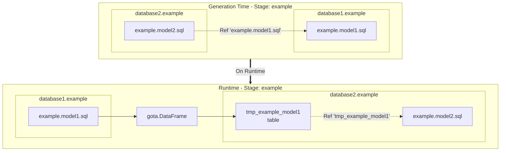
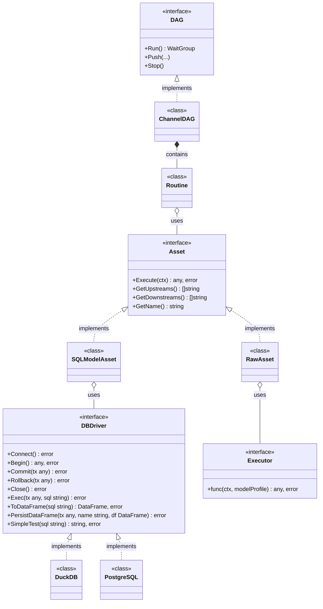

## Overview

Teal is a high-performance, scalable open-source ETL tool built on Go, designed to streamline data transformation and orchestration. It combines the best features of tools like [dbt](https://www.getdbt.com/), [Dagster](https://dagster.io/), and [Airflow](https://airflow.apache.org/), while solving common problems found in traditional Python-based solutions.

## Configuration

### config.yaml

The `config.yaml` file defines your project module and database connections:

```yaml
version: '1.0.0'
module: github.com/my_user/my_test_project
connections:
  - name: default
    type: duckdb
    config:
      path: ./store/test.duckdb
      extensions:
        - postgres
        - httpfs
```

**Parameters:**

| Param | Type | Description |
|-------|------|-------------|
| version | String constant | `1.0.0` |
| module | String | Generated Go module name |
| connections | Array of objects | Array of database connections |
| connections.name | String | Name of the connection used in the model profile |
| connections.type | String | Driver name: `duckdb`, `postgres` |

Teal supports multiple connections. See [Databases](#databases) section for specific configuration parameters.

### profile.yaml

The `profile.yaml` file defines your project structure and model stages:

```yaml
version: '1.0.0'
name: 'my-test-project'
connection: 'default'
models:
  stages:
    - name: staging
      models:
        - name: model1
          tests:
            - name: "root.test_model1_unique"
    - name: dds
    - name: mart
      models:
        - name: custom_asset
          materialization: 'raw'
          connection: 'default'
          raw_upstreams:
            - "dds.model1"
            - "dds.model2"
```

**Parameters:**

| Param | Type | Description |
|-------|------|-------------|
| version | String constant | `1.0.0` |
| name | String | Base name for generated binaries (creates both production and UI versions) |
| connection | String | Default connection from `config.yaml` |
| models.stages | Array | List of stages; folder `assets/models/<stage name>` must exist |

#### Model Profile

Asset profiles can be specified via `profile.yaml` or via a Go template in your SQL model file:

```sql
{{ define "profile.yaml" }}
    connection: 'default'
    description: 'Staging addresses from CSV file'
    materialization: 'table'
    is_data_framed: true
    primary_key_fields:
      - "id"
    indexes:
      - name: "wallet"
        unique: false
        fields:
          - "wallet_id"
{{ end }}

select
    id,
    wallet_id,
    wallet_address,
    currency
from read_csv('store/addresses.csv',
    delim = ',',
    header = true,
    columns = {
        'id': 'INT',
        'wallet_id': 'VARCHAR',
        'wallet_address': 'VARCHAR',
        'currency': 'VARCHAR'}
)
```

**Model Profile Parameters:**

| Param | Type | Default | Description |
|-------|------|---------|-------------|
| name | String | filename | Must match file name (without .sql extension) |
| description | String | | Optional description of the model's purpose |
| connection | String | profile.connection | Connection name from `config.yaml` |
| materialization | String | table | See [Materializations](#materializations) |
| is_data_framed | boolean | false | See [Cross-database references](#cross-database-references) |
| persist_inputs | boolean | false | See [Cross-database references](#cross-database-references) |
| primary_key_fields | Array of string | | List of fields for primary unique index |
| indexes | Array | | List of indexes (table and incremental only) |

## Materializations

Teal supports several materialization types for your SQL models:

| Materialization | Description |
|----------------|-------------|
| **table** | Result stored in table matching model name. If table exists, it's truncated. If not, it's created. |
| **incremental** | Result appended to existing table. If table doesn't exist, it's created. |
| **view** | SQL query saved as a view. |
| **custom** | Custom SQL query executed; no tables or views created. |
| **raw** | Custom Go function executed. |

## Template Functions

Teal uses the **[pongo2](https://github.com/flosch/pongo2) template engine** (v6), which is **Django-compatible**. This means you can use familiar Django/Jinja2 template syntax in your SQL models.

### Static and Dynamic Functions

Teal distinguishes between generation-time and runtime evaluation:

**Static functions** (evaluated during `teal gen` - **double braces** `{{ }}`):

```sql
{{ Ref("staging.model") }}  -- Replaced with actual table name during code generation
```

**Dynamic variables and functions** (evaluated at runtime - **single braces** `{ }`):

```sql
'{ TaskID }' as task_id
'{ TaskUUID }' as task_uuid
'{ InstanceName }' as instance
'{ InstanceUUID }' as instance_uuid
'{ ENV("SOURCE_SCHEMA", "public") }' as schema
```

**Dynamic control structures** (evaluated at runtime - Django/Jinja2 syntax):

```sql

    WHERE updated_at > (SELECT MAX(updated_at) FROM {{ this() }})

```

### List of Functions

| Name | Input Parameters | Output | When Evaluated | Description | Example |
|------|-----------------|--------|----------------|-------------|---------|
| Ref | `"<stage>.<model>"` | string | Static | Main function for DAG dependencies. Replaced with actual table name during `teal gen`. | `{{ Ref("staging.customers") }}` |
| this | None | string | Both | Returns the name of the current table. | `{{ this() }}` or `{ this() }` |
| ENV | `envName`, `defaultValue` | string | Dynamic | Gets environment variable value at runtime. | `{ ENV("DB_SCHEMA", "public") }` |
| IsIncremental | None | boolean | Dynamic | Returns true if model is in incremental mode. | `...` |
| TaskID | (variable) | string | Dynamic | The task identifier from the Push method. | `{ TaskID }` |
| TaskUUID | (variable) | string | Dynamic | The unique UUID assigned for task tracking. | `{ TaskUUID }` |
| InstanceName | (variable) | string | Dynamic | The DAG instance name. | `{ InstanceName }` |
| InstanceUUID | (variable) | string | Dynamic | The unique UUID assigned to the DAG instance. | `{ InstanceUUID }` |

### Complete Example

```sql
{{ define "profile.yaml" }}
    materialization: 'incremental'
    is_data_framed: true
{{ end }}

SELECT
    order_id,
    customer_id,
    order_date,
    total_amount,
    '{ TaskID }' as etl_task_id,
    '{ TaskUUID }' as etl_run_id,
    current_timestamp as processed_at
FROM {{ Ref("staging.raw_orders") }}

    WHERE order_date > (SELECT COALESCE(MAX(order_date), '1900-01-01') FROM {{ this() }})

```

## Databases

### DuckDB

**Configuration Parameters:**

| Param | Type | Description |
|-------|------|-------------|
| connections.type | String | `duckdb` |
| extensions | Array of strings | List of [DuckDB extensions](https://duckdb.org/docs/extensions/overview.html) |
| path | String | Path to the DuckDB database file |
| path_env | String | Environment variable containing the path (overrides `path`) |
| extraParams | Object | Name-value pairs for [DuckDB configuration](https://duckdb.org/docs/configuration/overview.html) |

### PostgreSQL

**Configuration Parameters:**

| Param | Type | Description |
|-------|------|-------------|
| connections.type | String | `postgres` |
| host | String | Hostname or IP address of PostgreSQL server |
| host_env | String | Environment variable name for host |
| port | String | Port number (default: 5432) |
| port_env | String | Environment variable name for port |
| database | String | Database name |
| database_env | String | Environment variable name for database |
| user | String | Username for authentication |
| user_env | String | Environment variable name for user |
| password | String | Password for authentication |
| password_env | String | Environment variable name for password |
| db_root_cert | String | Path to root certificate file for SSL |
| db_root_cert_env | String | Environment variable name for root cert path |
| db_cert | String | Path to client certificate file for SSL |
| db_cert_env | String | Environment variable name for client cert path |
| db_key | String | Path to client key file for SSL |
| db_key_env | String | Environment variable name for client key path |
| db_sslnmode | String | SSL mode: `disable`, `require`, `verify-ca`, `verify-full` |
| db_sslnmode_env | String | Environment variable name for SSL mode |

## Cross-Database References

Cross-database references allow seamless queries across different databases, even with different database drivers.

**Key Parameters:**

- **is_data_framed**: When `true`, query results are saved to a [gota.DataFrame](https://github.com/go-gota/) structure and passed to the next DAG node.
- **persist_inputs**: When `true`, all incoming DataFrames are saved to a temporary table in the database connection configured in the model profile.

**Example Workflow:**



## Raw Assets

Raw assets are custom functions written in Go that can accept and return dataframes with custom logic.

Raw assets must implement:

```go
type ExecutorFunc func(ctx *TaskContext, modelProfile *configs.ModelProfile) (interface{}, error)
```

**TaskContext provides:**
- `TaskID`: Task identifier
- `TaskUUID`: Unique UUID for tracking
- `InstanceName`: DAG instance name
- `InstanceUUID`: DAG instance UUID
- `Input`: Map of upstream asset results

**Retrieving upstream dataframes:**

```go
df := ctx.Input["dds.model1"].(*dataframe.DataFrame)
```

### Registration and Declaration

Register raw assets in the main function:

```go
processing.GetExecutors().Executors["<stage>.<asset name>"] = yourPackage.YourRawAssetFunction
```

Set upstream dependencies via `raw_upstreams` in the model profile.

## Data Testing

### Simple Model Testing

Tests verify data integrity by executing SQL queries that return row counts. If the count is zero, the test passes.

Tests should be placed in:
- `assets/tests/` - Root tests (stage: `root`)
- `assets/tests/<stage>/` - Stage-specific tests

**Test Naming:** `<stage>.<test_name>`

**Example:**

```sql
{{- define "profile.yaml" }}
    connection: 'default'
{{- end }}

select pk_id, count(pk_id) as c
from {{ Ref "dds.fact_transactions" }}
group by pk_id
having c > 1
```

Root tests are automatically executed after all DAG tasks complete when running with `--with-tests` flag.

#### Test Profile

```yaml
{{ define "profile.yaml" }}
    connection: 'default'
    description: 'Test that ensures airport keys are unique'
{{ end }}
```

**Parameters:**

| Param | Type | Default | Description |
|-------|------|---------|-------------|
| name | String | `<stage>.<filename>` | Test name pattern |
| description | String | | Optional description of what the test validates |
| connection | String | profile.connection | Connection name from `config.yaml` |

## General Architecture



## Understanding the Generated Main Files

Teal generates two entry points for different use cases:

### Production Binary (my-test-project.go)
- Uses **Channel DAG** for high-performance concurrent execution
- Generates unique task names with timestamps
- Optimized for production deployments
- No UI server or debugging overhead

### Debug UI Binary (my-test-project-ui.go)
- Uses **Debug DAG** for visualization and monitoring
- Provides REST API endpoints for DAG control and status
- Includes execution tracking and task history
- Ideal for development and debugging

**How It Works:**

1. `dag.Run()` builds a DAG based on Ref from your .sql models, where each node is an asset and each edge is a Go channel.
2. `dag.Push()` triggers the execution with a unique task name for tracking.
3. `dag.Stop()` sends the deactivation command.

## Using Generated Documentation with AI Assistants

The `docs/README.md` file generated by Teal contains comprehensive project information that can be directly included in AI code assistant contexts:

**Claude.ai / Claude Code:**
```
@docs/README.md - Include this file to provide complete project context
```

**Cursor IDE:**
```
Add docs/README.md to .cursorrules or reference: @docs/README.md
```

**GitHub Copilot (VS Code):**
```
Open docs/README.md in a tab or reference: // See docs/README.md
```

**Gemini Code Assist:**
```
Add docs/README.md to workspace context
```

**Example Prompts:**
- "Based on @docs/README.md, add a new mart layer asset aggregating transactions"
- "Using @docs/README.md, which database connection should staging models use?"
- "According to @docs/README.md, create an incremental model in the dds stage"

## Road Map

### Features (1.0.0+)
- [ ] Advanced Tests
- [ ] Seeds
- [ ] Pre/Post-hooks
- [ ] DataVault

### Database Support
- [ ] MySQL
- [ ] ClickHouse
- [ ] SnowFlake
- [ ] Apache Spark

### Workflow
- [ ] Temporal.io
- [ ] Kafka Distributed

## Contact

- **Name:** Boris Ershov
- **Email:** boris109@gmail.com
- **LinkedIn:** [Boris Ershov](https://www.linkedin.com/in/boris-ershov-2a4b9963/)
- **GitHub:** [go-teal/teal](https://github.com/go-teal/teal)
